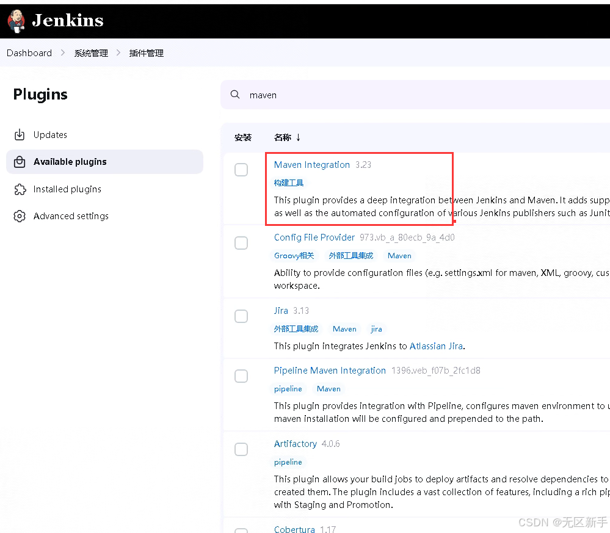
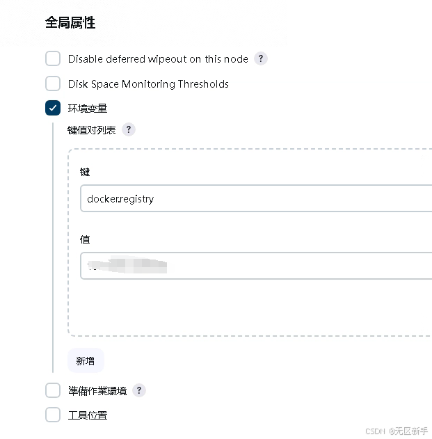
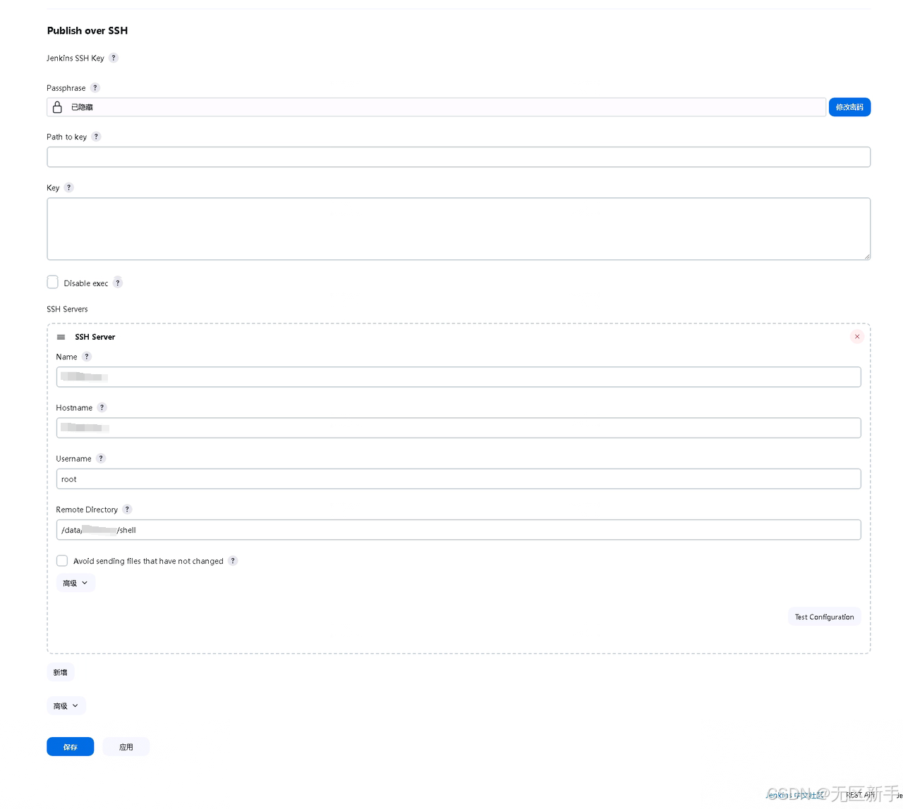
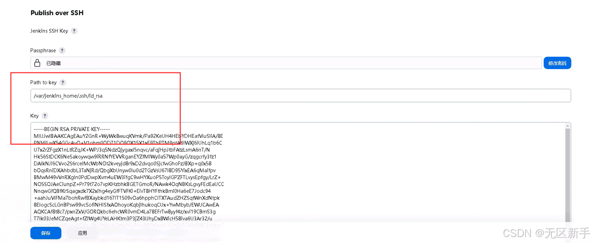
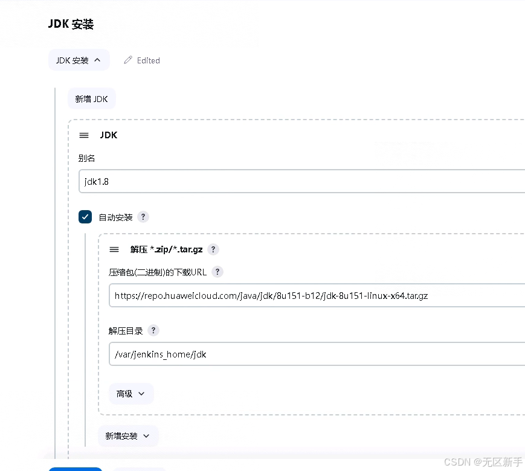
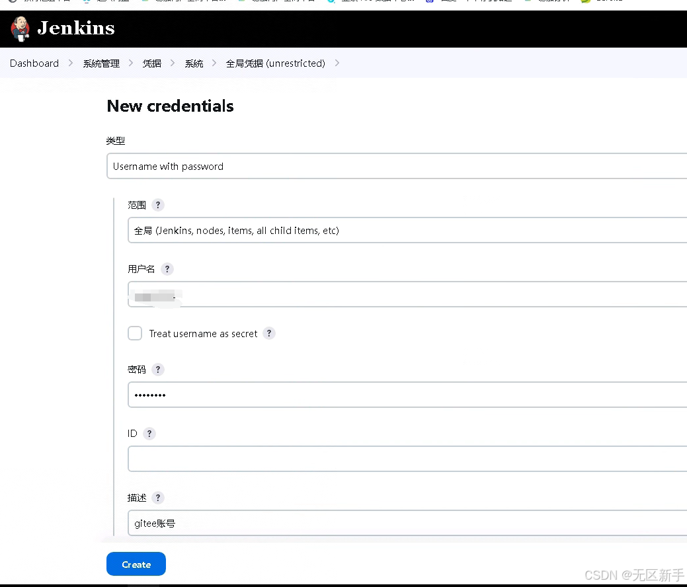

## Jenkins安装

```
# 创建文件夹
mkdir /data/ememory/jenkins/jenkins_home
 
# 赋权
chown -R 1000:1000 /data/ememory/jenkins/jenkins_home
 
# docker安装
# 自定义jdk地址，--mount type=bind,source=/data/ememory/jenkins/jdk8,target=/opt/jdk
# 自定义maven地址，--mount type=bind,source=/data/ememory/jenkins/maven,target=/opt/maven
docker run -itd --name jenkins -p 10240:8080 -p 10241:50000 \
--privileged=true --restart=always -e TZ=Asia/Shanghai \
--mount type=bind,source=/data/ememory/jenkins/jdk8,target=/opt/jdk \
--mount type=bind,source=/data/ememory/jenkins/jenkins_home,target=/var/jenkins_home \
 jenkins/jenkins:2.440.3-lts
 
 
# 进入容器
docker exec -it jenkins /bin/bash
# 执行命令修改源镜像
sed -i 's/http:\/\/updates.jenkins-ci.org\/download/https:\/\/mirrors.tuna.tsinghua.edu.cn\/jenkins/g' /var/jenkins_home/updates/default.json
 
sed -i 's/http:\/\/www.google.com/https:\/\/www.baidu.com/g' /var/jenkins_home/updates/default.json
 
# 修改源镜像，vi /var/jenkins_home/hudson.model.UpdateCenter.xml
# https://mirrors.tuna.tsinghua.edu.cn/jenkins/updates/update-center.json
<?xml version='1.1' encoding='UTF-8'?>
<sites>
  <site>
    <id>default</id>
    <url>https://mirrors.tuna.tsinghua.edu.cn/jenkins/updates/update-center.json</url>
  </site>
</sites>
 
# 查看初始密码
docker exec -it jenkins cat /var/jenkins_home/secrets/initialAdminPassword
 
# 自定义安装插件，添加中文插件：Localization: Chinese (Simplified)
 
# 设置账号密码
账号：root
密码：root
```
## 安装其他插件

- Maven
  - 
- Publish Over SSH
- Folders
- NodeJs

## 系统配置：全局参数、SSH

全局参数，任务里面可以使用${变量名}访问


配置SSH密码


配置SSH密钥
```
# 1.在jenkins服务器创建密钥
ssh-keygen -m PEM -t rsa -b 4096
# 2.复制私钥到配置中
cat ~/.ssh/id_rsa
# 3.添加公钥到目标服务器中
ssh-copy-id -i ~/.ssh/id_rsa.pub -p 22 root@127.0.0.1
```


## 全局工具配置 jdk，maven

- jdk存放地址：/var/jenkins_home
  - 
- maven直接选择版本安装
- nodejs直接选择版本安装，建议v18.12版本以上
  
## 配置凭证



## Jenkins使用
参考文档：https://developer.aliyun.com/article/892646