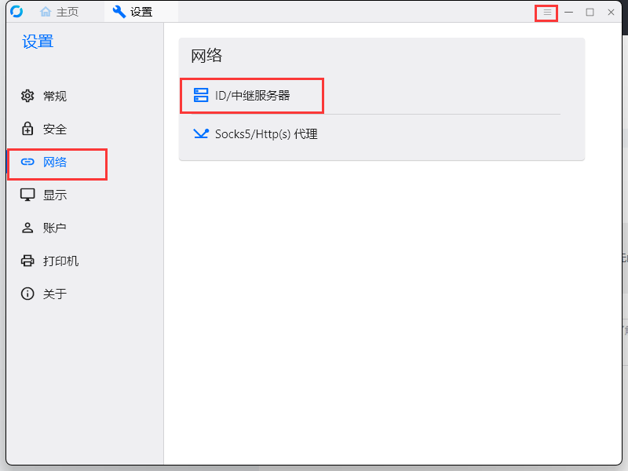
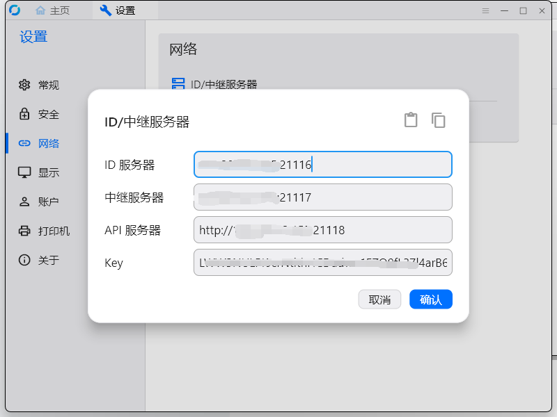

## 文档
[文档](https://rustdesk.com/docs/zh-cn/self-host/rustdesk-server-oss/docker/)

## docker部署
```
# 需要开放端口:tcp/21116,udp/21116,tcp/21117,tcp/21118
 
# 搭建中继服务器
# hbbs
docker run --name hbbs -p 21115:21115 -p 21116:21116 -p 21116:21116/udp -p 21118:21118 -v /data/rustdesk/hbbs:/root -td --net=host rustdesk/rustdesk-server hbbs
 
# hbbr
docker run --name hbbr -p 21117:21117 -p 21119:21119 -v /data/rustdesk/hbbr:/root -td --net=host rustdesk/rustdesk-server hbbr
 
# 在/data/rustdesk/hbbs下会存在id_ed25519.pub
# 查看id_ed25519.pub key
cat /data/rustdesk/hbbs/id_ed25519.pub
```

## docker-compose.yml
```
services:
  hbbs:
    container_name: hbbs
    image: rustdesk/rustdesk-server:latest
    command: hbbs
    volumes:
      - /data/rustdesk/hbbs:/root
    network_mode: "host"
 
    depends_on:
      - hbbr
    restart: unless-stopped
 
  hbbr:
    container_name: hbbr
    image: rustdesk/rustdesk-server:latest
    command: hbbr
    volumes:
      - /data/rustdesk/hbbr:/root
    network_mode: "host"
    restart: unless-stopped
```

## 客户端设置



- ID服务器：ip:21116
- 中继服务器：ip:21117
- API服务器：http://ip:21118
- Key：cat /data/rustdesk/hbbs/id_ed25519.pub 的值